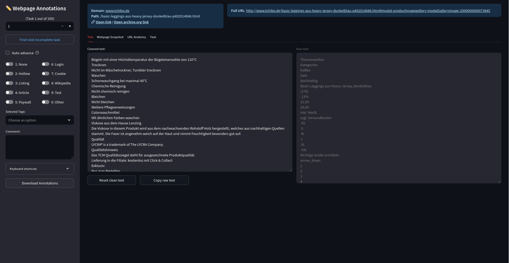

# Seek2Judge: Webpage Annotations

- [Description](#description)
- [Quickstart](#quickstart)
- [Quick Configuration](#quick-configuration)
- [Further Documentation](#further-documentation)
- [Additional Resources](#additional-resources)

## Description

This web application is designed to label scraped webpages. It allows users to annotate and tag web content for further analysis. With this application, you can easily label and categorize webpages based on your specific requirements.



## Quickstart
For more information, see the next section "Further Documentation".

### 1. Clone the Repository
```bash
git clone https://gitlab.inf.uni-konstanz.de/julian.schelb/seek2judge-annotations.git
cd seek2judge-annotations
```

### 2. Setup a Virtual Environment
For example install `pyenv` as per [their instructions](https://github.com/pyenv/pyenv#installation) and setup a virtual environment for the project:
```bash
pyenv install 3.10.12
pyenv virtualenv 3.10.12 seek2judge-env
```

Then start the virtual environment:
```bash
pyenv activate seek2judge-env
```

### 3. Install the Requirements
```bash
pip install -r requirements.txt
``` 

### 4. Start the Project
```bash
streamlit run src/app.py
```

Notice that a new `.env` file has been created from the `.env-example` file, which uses the example data located in `example_workdir`.

At this point you can take a look around. Maybe the [usage documentation](doc/03-USAGE.md) can be of service.

## Quick Configuration
### 1. Open the `.env` or copy and edit the `.env-example` to begin configuration
```bash
cp .env-example .env
```

### 2. Set up the `WORKING_DIR` and `LABELS`
```bash
WORKING_DIR = '/PATH/TO/WORKING_DIRECTORY'
LABELS = 'label_1,label_2,label_3'
```

### 3. Make sure that the `TASKS_FILE` and `HTML_DIR` are in the `WORKING_DIRECTORY`
The `TASKS_FILE` should contain, at least, two columns which are defined by `TASKS_ID_COLUMN` and `TASKS_URL_COLUMN`.

The `HTML_DIR` should contain the html files that are associated with the tasks. The following naming scheme should be used for the html files: `TASK_ID.html`, where `TASK_ID` is the value of the `TASKS_ID_COLUMN`.

In general your folder structure should look like so:
```
WORKING_DIR/
├── TASKS_FILE
└── HTML_DIR
    ├── FIRST_ID.html
    ├── SECOND_ID.html
    └── ...
```

If you use the `.env-example`, the program will assume the following naming
```
example_workdir
├── tasks.csv
└── html
    ├── FIRST_ID.html
    ├── SECOND_ID.html
    └── ...
```

## Further Documentation
A more detailed guide to setting up the project can be found in the [doc folder](doc). It will lead you through the process using the example data of the [example_workdir](example_workdir).

1. [Installation](doc/01-INSTALLATION.md)
2. [Configuration](doc/02-CONFIGURATION.md)
3. [Usage](doc/03-USAGE.md)

## Additional Resources
For more information on how to use Streamlit, refer to the [Streamlit Documentation](https://docs.streamlit.io/library/api-reference).